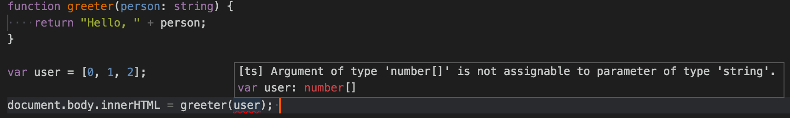

> 官方参考：<https://www.typescriptlang.org/docs/tutorial.html>

TypeScript 是微软在 2012 年推出的，作为 JavaScript 的超集，完全兼容 JavaScript。相比于 JavaScript，TypeScript 增加了可选类型、类和模块，扩展了语法，使得代码组织和复用变得更加简单有序。

> TypeScript is a typed superset of JavaScript that compiles to plain JavaScript. Any browser. Any host. Any OS. Open source.

TypeScript 提供了十分丰富的开发工具，同时各大主流的编辑器和 IDE 都有相应的插件。你可以随你的喜好选择自己心仪的编辑器和 IDE：

* [Visual Studio 2015](https://www.microsoft.com/en-us/download/details.aspx?id=48593) 原生支持 TypeScript
* [Visual Studio 2013](https://www.microsoft.com/en-us/download/details.aspx?id=48739) Update 2 支持 TypeScript
* [Visual Studio Code](https://code.visualstudio.com/) 原生支持 TypeScript
* [Sublime Text](http://www.sublimetext.com/) 安装 [插件](https://github.com/Microsoft/TypeScript-Sublime-Plugin)
* [Atom](https://atom.io) 安装 [插件](https://atom.io/packages/atom-typescript)
* [Vim](http://www.vim.org/) 安装 [插件](https://github.com/Microsoft/TypeScript/wiki/TypeScript-Editor-Support#vim)
* [Emacs](https://www.gnu.org/software/emacs/) 安装 [插件](https://github.com/ananthakumaran/tide)
* [Eclipse](http://www.eclipse.org/) 安装 [插件](https://github.com/palantir/eclipse-typescript)
* [WebStorm](https://www.jetbrains.com/webstorm/) 已原生支持


这里，我会用微软的 [Visual Studio Code](https://code.visualstudio.com/)，一家人，原生支持。虽然名字取的很大，但却是一个挺小巧的 IDE 式的编辑器。

---

让我们这就用 TypeScript 来写一个简单的 Web 应用吧。

# 安装 TypeScript

有两个主要的途径来安装 TypeScript：

* npm 进行安装（你需要已安装 [node.js](https://nodejs.org)）
* 安装 Visual Studio 的 TypeScript 插件

作为前端，我想 99% 会选择用 npm 吧：

```
npm install -g typescript
```

安装成功：

```
/usr/local/bin/tsc -> /usr/local/lib/node_modules/typescript/bin/tsc
/usr/local/bin/tsserver -> /usr/local/lib/node_modules/typescript/bin/tsserver
/usr/local/lib
└── typescript@1.8.10
```

# 你的第一个 TypeScript 文件

在编辑器中，新建文件 `greeter.ts`，内容如下：

```ts
function greeter(person) {
    return "Hello, " + person;
}

var user = "Jane User";

document.body.innerHTML = greeter(user);
```

如上，虽然我们使用的是 `.ts` 后缀，但内容却是纯粹的 JavaScript 代码，这是合法的 TypeScript 代码，因为如前所说，TypeScript 是 JavaScript 的一个超集。

我们需要把它编译成 JavaScript。在命令行，进入文件所在的目录，执行如下命令：

```
tsc greeter.ts
```

VSCode 的快捷键 「Ctrl + `」可以召唤出它集成的系统 terminal，你可以很方便地在一个编辑器中处理所相关的事情。


结果就会生成 `greeter.js`，其内容跟 `.ts` 中的基本无差。就这样简单，我们可以开始用 TypeScript 来写应用啦。

接下来，我们就来体验以下 TypeScript 给我们带来的便利性吧。

我们先给前面的方法中的 `person` 参数加个 `: string` 注解，如下：

```ts
function greeter(person : string) {
    return "Hello, " + person;
}

var user = "Jane User";

document.body.innerHTML = greeter(user);
```

# 类型注解

在 TypeScript 中，类型注解就好比是方法或变量的轻型约束，这个例子里，我们约定 `greeter` 方法在调用的时候，调用着会传入 `string` 类型的 `person` 参数。我们来看看，假设有意传一个数组进去，会怎样：

```ts
function greeter(person: string) {
    return "Hello, " + person;
}

var user = [0, 1, 2];

document.body.innerHTML = greeter(user); 
```

重新编译，我们会看到这样一条错误信息：

```
greeter.ts(7,35): error TS2345: Argument of type 'number[]' is not assignable to parameter of type 'string'.
```

VSCode 足够聪明，它会帮你滑亮错误的代码，你可以看到详细的错误信息：



如果你没有传任何参数，你会得到如下错误说参数数量不合规范：

```
greeter.ts(7,27): error TS2346: Supplied parameters do not match any signature of call target.
```


如上两种类型的错误，说明了 TypeScript 可以基于代码结构和类型注解，为我们提供静态分析的结果，以减小代码出错的几率。

你也可能已经注意到了，虽然有错误报出来了，但 `greeter.js` 还是平安出生了，即使你的代码中有错误，你的 TypeScript 可能还可以用。这里，TypeScript 是在警告你，你的代码很有可能运行不如你的预期。

# 接口（interface）

继续。这里我们用一个接口（interface）来定义一个带 `firstName` 和 `lastName` 属性的对象。在 TypeScript 中，如果两种类型的内部结构相互兼容，则表明这两种类型也是相互兼容的。这允许我们定义接口的时候，仅仅只需要保证它存在要求的属性即可，并不需要真正写实现的逻辑代码。

```ts
interface Person {
    firstName: string;
    lastName: string;
}

function greeter(person: Person) {
    return "Hello, " + person.firstName + " " + person.lastName;
}

var user = {
  firstName: "Jane",
  lastName: "User"
};

document.body.innerHTML = greeter(user);
```

# 类

我们最后再来提升一下我们的例子代码，用类的形式。TypeScript 支持 JavaScript 的新特性，基于类的面向对象的编程便是其中之一。

我们来创建一个 `Student` 类，给它一个构造器和一些公用的属性。虽然 `interface` 和 `class` 都可以用，程序员需要决定如何更恰当地对事物进行抽象。

这里提醒一下，构造器参数上的 `public` 是创建属性的快捷方式，会自动以该参数名为名称的属性。

```ts
class Student {
    fullName: string;
    constructor(public firstName, public middleInitial, public lastName) {
        this.fullName = firstName + " " + middleInitial + " " + lastName;
    }
}

interface Person {
    firstName: string;
    lastName: string;
}

function greeter(person : Person) {
    return "Hello, " + person.firstName + " " + person.lastName;
}

var user = new Student("Jane", "M.", "User");

document.body.innerHTML = greeter(user);
```

再次执行命令 `tsc greeter`，你会发现生成的代码跟之前无差。TypeScript 中的类其实就是 JavaScript 基于原型的面向对象编程的一种快捷方式。

# 在网络应用中运行 TypeScript

我们来创建 `greeter.html`：

```html
<!DOCTYPE html>
<html>
<head><title>TypeScript Greeter</title></head>
<body>
<script src="greeter.js"></script>
</body>
</html>
```

然后，用你的浏览器打开 `greeter.html`